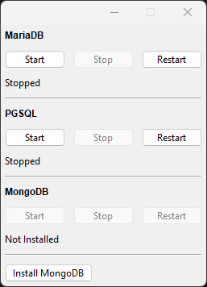

# rf_db_engine - Database Server Pack in One App

[README dengan Bahasa Indonesia Klik di Sini](https://github.com/rakifsul/rf_db_engine/blob/main/README_id.md)

English

## Intro

This application is capable of managing multiple types of database servers through a single main application.

Currently, there are three supported database servers:

- MariaDB
- PGSQL
- MongoDB

Specifically for MongoDB, it is not included directly in this package, so you need to click the "Install MongoDB" button first.

## Where to Download

Download the executables on "Releases" page.

## Where are the Source Codes

Source codes are included in the zip along with the executables.

## How to use

It is easy to use, as each server has 3 control buttons: Start, Stop, and Restart.

Bahasa Indonesia

## Pendahuluan

Aplikasi ini adalah aplikasi yang dapat mengatur banyak jenis database server dengan satu aplikasi utama.

Saat ini, ada tiga database server yang didukung:

-	MariaDB
-	PGSQL
-	MongoDB

Khusus MongoDB, saya tidak menyertakannya langsung dalam paket ini, jadi Anda harus klik tombol "Install MongoDB" terlebih dahulu.

## Download di Mana

Download executable-nya di halaman "Releases".

## Di Mana Source Code-nya

Source code ada di dalam paket zip bersama executable-nya.

## Cara Penggunaan

Penggunaannya cukup mudah, karena masing-masing server memiliki 3 tombol pengendali: Start, Stop, dan Restart.

## Screenshot

	

## Freelance Worker Link

- https://projects.co.id/public/browse_users/view/99bc11/rakifsul