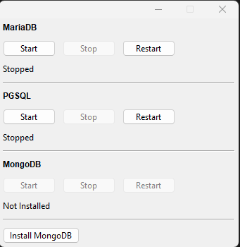

# rf_db_engine - Kumpulan Server Database dalam Satu Aplikasi

## Pendahuluan

Aplikasi ini adalah aplikasi yang dapat mengatur banyak jenis database server dengan satu aplikasi utama.

Saat ini, ada tiga database server yang didukung:

-	MariaDB
-	PGSQL
-	MongoDB

Khusus MongoDB, saya tidak menyertakannya langsung dalam paket ini, jadi Anda harus klik tombol "Install MongoDB" terlebih dahulu.

## Download di Mana

Download executable-nya di halaman "Releases".

## Cara Penggunaan

Penggunaannya cukup mudah, karena masing-masing server memiliki 3 tombol pengendali: Start, Stop, dan Restart.

## Screenshot

	

